# GCP Billing Agent - System Architecture

## Overview
This document describes the overall architecture of the GCP Billing Agent application, from Agent Engine deployments through Cloud Run services to end-user interactions.

## Architecture Diagram

```mermaid
graph TB
    subgraph "User Layer"
        User[👤 End User<br/>asl.apps-eval.com]
        Browser[🌐 Web Browser]
    end

    subgraph "Cloud Run Services"
        UI[Frontend UI Service<br/>agent-engine-ui<br/>React + Vite]
        API[Backend API Service<br/>agent-engine-api<br/>FastAPI]
    end

    subgraph "Vertex AI Agent Engine"
        Agent1[Reasoning Engine 1<br/>bq_agent<br/>ID: 1660126218499915776]
        Agent2[Reasoning Engine 2<br/>bq_agent_mick<br/>ID: 291031931779284992]
    end

    subgraph "Google Cloud Services"
        Firestore[(Firestore Database<br/>Users & Query History)]
        BigQuery[(BigQuery<br/>GCP Billing Data)]
    end

    subgraph "Authentication & Security"
        JWT[JWT Tokens<br/>Custom Auth]
        SA_API[Service Account<br/>agent-engine-api-sa]
        SA_UI[Service Account<br/>agent-engine-ui-sa]
        IAM[IAM Roles & Permissions]
    end

    subgraph "Data Flow"
        AuthFlow[Authentication Flow]
        QueryFlow[Query Flow]
        AgentDiscovery[Agent Discovery]
    end

    %% User interactions
    User --> Browser
    Browser -->|HTTPS| UI
    Browser -->|API Calls| API

    %% Frontend to Backend
    UI -->|REST API<br/>HTTPS| API

    %% Authentication
    Browser -->|Signup/Login| API
    API -->|Store Credentials| Firestore
    API -->|Verify/Generate| JWT
    JWT -->|Bearer Token| Browser
    Browser -->|Authenticated Requests| API

    %% Agent Discovery (Auto-scan)
    API -->|List Reasoning Engines<br/>GET /reasoningEngines| Agent1
    API -->|List Reasoning Engines<br/>GET /reasoningEngines| Agent2
    Agent1 -->|Agent Metadata| API
    Agent2 -->|Agent Metadata| API
    API -->|Cache Configs<br/>5 min TTL| AgentDiscovery

    %% Query Flow
    Browser -->|Query Request<br/>POST /query/stream| API
    API -->|Stream Query<br/>POST :streamQuery| Agent1
    API -->|Stream Query<br/>POST :streamQuery| Agent2
    Agent1 -->|Stream Response<br/>SSE| API
    Agent2 -->|Stream Response<br/>SSE| API
    API -->|Forward Stream<br/>Server-Sent Events| Browser

    %% Agent to BigQuery
    Agent1 -->|Query BigQuery<br/>Read-Only| BigQuery
    Agent2 -->|Query BigQuery<br/>Read-Only| BigQuery

    %% Save Query History
    API -->|Save Query/Response| Firestore

    %% Service Account Permissions
    SA_API -->|Uses Credentials| IAM
    SA_UI -->|Uses Credentials| IAM
    IAM -->|aiplatform.reasoningEngines.*<br/>bigquery.*<br/>datastore.*| Agent1
    IAM -->|aiplatform.reasoningEngines.*<br/>bigquery.*<br/>datastore.*| Agent2
    IAM -->|datastore.*| Firestore
    IAM -->|bigquery.*| BigQuery

    %% Styling
    classDef userLayer fill:#e1f5ff,stroke:#01579b,stroke-width:2px
    classDef cloudRun fill:#f3e5f5,stroke:#4a148c,stroke-width:2px
    classDef agentEngine fill:#e8f5e9,stroke:#1b5e20,stroke-width:2px
    classDef dataStore fill:#fff3e0,stroke:#e65100,stroke-width:2px
    classDef security fill:#ffebee,stroke:#b71c1c,stroke-width:2px

    class User,Browser userLayer
    class UI,API cloudRun
    class Agent1,Agent2 agentEngine
    class Firestore,BigQuery dataStore
    class JWT,SA_API,SA_UI,IAM security
```

## Component Details

### 1. Frontend UI Service (Cloud Run)
- **Service**: `agent-engine-ui`
- **Technology**: React + Vite
- **Function**: 
  - User interface for chat-based interaction
  - Authentication UI (signup/login)
  - Agent selection dropdown
  - Query history display
  - Table formatting for agent responses

### 2. Backend API Service (Cloud Run)
- **Service**: `agent-engine-api`
- **Technology**: FastAPI (Python)
- **Function**:
  - REST API endpoints
  - JWT authentication
  - Agent discovery (auto-scan from Agent Engine)
  - Query streaming to reasoning engines
  - Query history management
  - Firestore integration

### 3. Vertex AI Agent Engine
- **Deployments**:
  - `bq_agent` - BigQuery billing analysis agent
  - `bq_agent_mick` - BigQuery billing analysis agent (variant)
- **Function**:
  - Execute natural language queries
  - Query BigQuery with read-only access
  - Return structured responses
  - Maintain conversation context

### 4. Firestore Database
- **Collections**:
  - `users` - User accounts (email, hashed passwords)
  - `query_history` - Query/response history per user
- **Function**:
  - User authentication storage
  - Query history persistence
  - Per-user data isolation

### 5. BigQuery
- **Dataset**: `gcp_billing_data`
- **Table**: `billing_data_ndjson`
- **Function**:
  - Store GCP billing export data
  - Provide read-only access to agents
  - Support complex billing analysis queries

## Sequence Diagrams

### Authentication Flow

### Agent Discovery Flow

### Query Flow

## Data Flows

### Authentication Flow
1. User signs up with `@asl.apps-eval.com` email
2. Backend validates domain and hashes password (bcrypt)
3. User credentials stored in Firestore
4. Backend generates JWT token
5. Frontend stores token and sends in subsequent requests

### Agent Discovery Flow
1. Backend starts up or cache expires (5 min TTL)
2. Backend calls Vertex AI API: `GET /reasoningEngines`
3. API returns list of all deployed reasoning engines
4. Backend processes and caches agent configs
5. Frontend calls `/agents` endpoint to get available agents
6. Dropdown populated with discovered agents

### Query Flow
1. User selects agent and types query
2. Frontend sends authenticated request to `/query/stream`
3. Backend validates JWT and extracts user_id
4. Backend streams query to selected reasoning engine: `POST /reasoningEngines/{id}:streamQuery`
5. Reasoning engine queries BigQuery (if needed)
6. Agent processes query and streams response back
7. Backend forwards stream to frontend via Server-Sent Events (SSE)
8. After completion, backend saves query/response to Firestore
9. Frontend displays response and updates history

## Security & IAM

### Service Accounts
- **API Service Account** (`agent-engine-api-sa`):
  - Custom role: `gcpBillingAgentService`
  - Permissions: `aiplatform.reasoningEngines.*`, `bigquery.*`, `datastore.*`
  - Also has: `roles/aiplatform.admin` (for comprehensive access)
  
- **UI Service Account** (`agent-engine-ui-sa`):
  - Permissions: `roles/run.invoker` (to invoke API service)

### Authentication
- Custom JWT-based authentication
- Domain restriction: `@asl.apps-eval.com` only
- Password hashing: bcrypt (72-byte limit enforced)
- Token expiration: Configurable (default 7 days)

### Network Security
- Cloud Run services: Public HTTPS ingress (`--ingress=all`)
- No VPC connector (simplified deployment)
- CORS configured for UI → API communication
- All traffic encrypted via HTTPS/TLS

## Deployment Architecture

### Deployment Flow
1. **Infrastructure Setup** (`01-infrastructure.sh`):
   - Enable APIs
   - Create service accounts
   - Set up IAM permissions

2. **IAM Configuration** (`02-iam-permissions.sh`):
   - Create custom IAM role
   - Grant permissions to service accounts

3. **Application Deployment** (`03-applications.sh`):
   - Build Docker images (Cloud Build)
   - Deploy backend to Cloud Run
   - Deploy frontend to Cloud Run
   - Set environment variables
   - Configure service accounts

4. **Agent Engine Deployments** (separate):
   - Deploy agents using ADK CLI
   - Agents automatically discovered by backend

## Scaling & Performance

- **Cloud Run**: Auto-scaling (0 to N instances)
- **Agent Discovery**: 5-minute cache TTL to reduce API calls
- **Query Streaming**: Server-Sent Events for real-time responses
- **Firestore**: Automatic scaling for user and history data
- **BigQuery**: Serverless, automatically scales to query size

## Monitoring & Logging

- **Cloud Run Logs**: Application logs, startup logs, errors
- **Cloud Logging**: Centralized logging for all services
- **Error Handling**: Graceful fallbacks for agent discovery
- **Health Checks**: Built-in Cloud Run health checks

## Future Enhancements

- [ ] Add authentication middleware for additional security layers
- [ ] Implement rate limiting per user
- [ ] Add query result caching
- [ ] Support for additional data sources
- [ ] Multi-domain support (e.g., innovationbox.cloud)
- [ ] Admin dashboard for user management
- [ ] Query analytics and usage metrics

